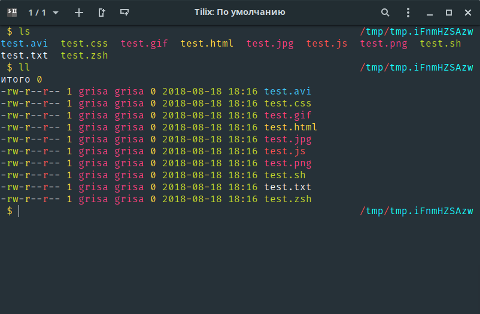

# ls
Zsh plugin for ls. It improves the output of `ls`, and adds the following aliases:

* `l` - similar to `ls`
* `la` - similar to `ls`, but show all files
* `lsd` - show only directories
* `ll` - show files line by line

#### Note
For a better view, use a theme for `dircolors`, for example [dircolors-material](https://github.com/zpm-zsh/dircolors-material)
