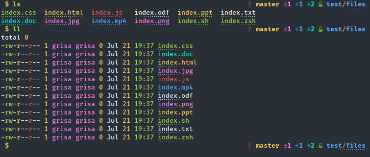

# Ls



Zsh plugin for ls. It improves the output of `ls`, and adds the following aliases:

* `l` - show files
* `ls` - show files
* `la` - show all files
* `ll` - show files line by line
* `lt` - show file tree in a folder

This plugin supports [lsd](https://github.com/Peltoche/lsd), [exa](https://github.com/ogham/exa)/[eza](https://github.com/eza-community/eza) and [GNU ls](https://www.gnu.org/software/coreutils/manual/html_node/ls-invocation.html) backends.

You can change ls backend using `ZSH_LS_BACKEND` variable, set it to `lsd`, `exa` or `ls`.
If no `ZSH_LS_BACKEND` is defined as environment variable then backend will be selected automatically: `lsd`, or `eza`/`exa`, or `ls`

> You can disable git integration in eza/exa using this:

```sh
export ZSH_LS_DISABLE_GIT=true
```

## Note

For a better view, use a theme for `dircolors`, for example [dircolors-material](https://github.com/zpm-zsh/dircolors-material)

## How to install

### [zpm](https://github.com/zpm-zsh/zpm)

Add the following to your .zshrc file somewhere after you source zpm.

```sh
zpm load zpm-zsh/ls
```

### [oh-my-zsh](http://github.com/robbyrussell/oh-my-zsh)

* Download the script or clone this repository in [oh-my-zsh](http://github.com/robbyrussell/oh-my-zsh) plugins directory:

```sh
cd ~/.oh-my-zsh/custom/plugins
git clone https://github.com/zpm-zsh/ls.git
```

* Activate the plugin in `~/.zshrc`:

```sh
plugins=( [plugins...] ls [plugins...])
```

* Restart shell

### [antigen](https://github.com/zsh-users/antigen)

Add `antigen bundle zpm-zsh/ls` to your .zshrc where you're adding your other plugins. Antigen will clone the plugin for you and add it to your antigen setup the next time you start a new shell.

### [zinit](https://github.com/zdharma-continuum/zinit)

Add `zinit load zdharma-continuum/history-search-multi-word` to your .zshrc, and Zinit will automatically handle cloning the plugin for you the next time you start zsh.

### [prezto](https://github.com/sorin-ionescu/prezto)

For most people the easiest way to use zshmarks with [prezto](https://github.com/sorin-ionescu/prezto) is to manually clone the zshmarks repo to a directory of your choice (e.g. /usr/local or ~/bin) and symlink the zshmarks folder into your zpretzo/modules folder:

```sh
ln -s ~/bin/ls ~/.zprezto/modules/ls
```

Alternatively, you can add the zshmarks repository as a submodule to your prezto repo by manually editing the '.gitmodules' file:

```ini
[submodule "modules/ls"]
        path = modules/ls
        url = https://github.com/zpm-zsh/ls.git
```

Then make sure you activate the plugin in your .zpreztorc file:

```sh
zstyle ':prezto:load' pmodule ls
```

### [zplug](https://github.com/zplug/zplug)

Add the following to your .zshrc file somewhere after you source zplug.

```sh
zplug "zpm-zsh/ls"
```
